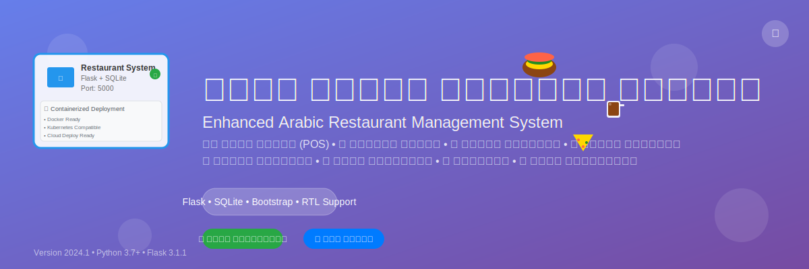

<div align="center">
  
</div>

# نظام إدارة المطاعم المحسن - الإصدار العربي الكامل

## 🌟 نظرة عامة
نظام شامل لإدارة المطاعم والمقاهي باللغة العربية، مطور باستخدام Flask (Python) مع قاعدة بيانات SQLite وواجهة مستخدم عربية متجاوبة.

## 🚀 الرابط المباشر للنظام
**https://dyh6i3c067lv.manus.space**

[](https://dyh6i3c067lv.manus.space)
[](https://docker.com)
[](https://kubernetes.io)
[](https://python.org)
[](https://flask.palletsprojects.com)
[](https://sqlite.org)
[](https://github.com)
[](https://github.com)

## ✨ الميزات الرئيسية

<table>
<tr>
<td width="50%">

### 🍽️ إدارة المطعم
- **نقطة البيع (POS)** - نظام بيع متقدم
- **إدارة القائمة** - أصناف متنوعة مع أسعار
- **نظام الطلبات** - تتبع الطلبات في الوقت الفعلي
- **إدارة العملاء** - قاعدة بيانات شاملة

</td>
<td width="50%">

### 📊 التقارير والإحصائيات
- **تقارير المبيعات** - تحليل الأداء اليومي والشهري
- **إحصائيات المخزون** - مراقبة الأصناف والكميات
- **تقارير العملاء** - تحليل سلوك العملاء
- **تقارير مالية** - الإيرادات والمصروفات

</td>
</tr>
<tr>
<td width="50%">

### 👥 إدارة المستخدمين
- **نظام الصلاحيات** - أدوار متعددة ومتدرجة
- **تسجيل الدخول الآمن** - حماية البيانات
- **إدارة الورديات** - تتبع أوقات العمل
- **ملفات شخصية** - معلومات المستخدمين

</td>
<td width="50%">

### 🚚 التوصيل والخدمات
- **إدارة الطيارين** - تتبع عمال التوصيل
- **نظام التوصيل** - إدارة الطلبات الخارجية
- **تتبع الطلبات** - حالة التوصيل في الوقت الفعلي
- **حسابات الطيارين** - عمولات ومكافآت

</td>
</tr>
</table>

## 📋 المتطلبات التقنية
- Python 3.7 أو أحدث
- Flask 3.1.1
- Flask-CORS 6.0.0
- SQLite3 (مدمج مع Python)
- متصفح ويب حديث

## 🚀 البدء السريع

### 🐳 Containerized Deployment (Recommended)

#### Using Docker
```bash
# Clone the repository
git clone https://github.com/your-username/restaurant-management-system.git
cd restaurant-management-system

# Build the Docker image
docker build -t restaurant-management-system .

# Run the container
docker run -p 5000:5000 restaurant-management-system
```

#### Using Docker Compose
```bash
# Start all services
docker-compose up -d

# View logs
docker-compose logs -f

# Stop services
docker-compose down
```

#### Using Kubernetes
```bash
# Apply Kubernetes manifests
kubectl apply -f k8s-deployment.yaml

# Check deployment status
kubectl get pods
kubectl get services
```

### 1. تشغيل النظام محلياً (بدون Docker)
```bash
# فك ضغط الملف
unzip restaurant_management_system.zip
cd restaurant_system_download

# إنشاء بيئة افتراضية (اختياري)
python -m venv venv
source venv/bin/activate  # على Linux/Mac
# أو
venv\Scripts\activate     # على Windows

# تثبيت المتطلبات
pip install -r requirements.txt

# تشغيل النظام
python src/main.py
```

### 2. الوصول للنظام
افتح المتصفح وانتقل إلى: `http://localhost:5000`

## 📸 لقطات الشاشة

<div align="center">
  <table>
    <tr>
      <td align="center">
        
        <br><strong>صفحة تسجيل الدخول</strong>
      </td>
      <td align="center">
        
        <br><strong>لوحة التحكم الرئيسية</strong>
      </td>
    </tr>
    <tr>
      <td align="center">
        
        <br><strong>نقطة البيع (POS)</strong>
      </td>
      <td align="center">
        
        <br><strong>التقارير والإحصائيات</strong>
      </td>
    </tr>
  </table>
</div>

> **ملاحظة:** هذه صور تجريبية. يمكنك رؤية النظام الحقيقي عبر [الرابط المباشر](https://dyh6i3c067lv.manus.space)

## 🏗️ Containerized Deployment Architecture

<div align="center">
  
</div>

### 📦 Container Features

| Feature | Description |
|---------|-------------|
| **🐳 Docker Ready** | Pre-configured Dockerfile for easy deployment |
| **☸️ Kubernetes Compatible** | Full K8s manifests for production deployment |
| **🐙 Docker Compose** | Multi-service orchestration with Nginx & Redis |
| **☁️ Cloud Ready** | Compatible with AWS, GCP, Azure, and other cloud providers |
| **🔒 Security** | Environment variables for secrets management |
| **📊 Monitoring** | Health checks and logging configured |
| **🔄 Auto-restart** | Automatic container restart on failure |
| **💾 Persistent Storage** | Database and logs persistence |

### 🚀 Quick Deploy Commands

```bash
# Docker (Single Container)
docker run -d -p 5000:5000 --name restaurant-system restaurant-management-system

# Docker Compose (Multi-Service)
docker-compose up -d

# Kubernetes (Production)
kubectl apply -f k8s-deployment.yaml

# Cloud Deploy (Example: AWS ECS)
aws ecs create-service --cluster my-cluster --service-name restaurant-system --task-definition restaurant-system
```

## 🔐 حسابات المستخدمين

### 👨‍💼 مدير النظام
- **اسم المستخدم:** admin
- **كلمة المرور:** password
- **البريد الإلكتروني:** admin@restaurant.com
- **الصلاحيات:** كاملة - إدارة جميع الوحدات

### 👨‍💻 مدير الفرع
- **اسم المستخدم:** manager
- **كلمة المرور:** 123456
- **البريد الإلكتروني:** manager@restaurant.com
- **الصلاحيات:** إدارة الفرع والعمليات اليومية

### 👨‍🏫 المشرف العام
- **اسم المستخدم:** supervisor
- **كلمة المرور:** super123
- **البريد الإلكتروني:** supervisor@restaurant.com
- **الصلاحيات:** الإشراف والمتابعة

### 💰 أمين الصندوق
- **اسم المستخدم:** cashier
- **كلمة المرور:** cashier123
- **البريد الإلكتروني:** cashier@restaurant.com
- **الصلاحيات:** نقطة البيع والمبيعات

### 🍽️ النادل
- **اسم المستخدم:** waiter
- **كلمة المرور:** waiter123
- **البريد الإلكتروني:** waiter@restaurant.com
- **الصلاحيات:** خدمة العملاء والطلبات

## 🏗️ هيكل النظام

### الوحدات الرئيسية:

#### 🏛️ التكويدات
- **المحافظات:** إدارة المحافظات والمناطق الجغرافية
- **المناطق:** تقسيم المحافظات إلى مناطق فرعية

#### 📦 الأصناف
- **مجموعات الأصناف:** تصنيف المنتجات (دجاج مقلي، برجر، مشروبات، إلخ)
- **الأقسام:** تنظيم الأقسام الإدارية (مطبخ، كاشير، توصيل)
- **كارت الصنف:** إدارة تفاصيل المنتجات والأسعار
- **تقارير الأصناف:** تقارير شاملة عن المنتجات

#### 🛒 المشتريات
- **قائمة المشتريات:** إدارة طلبات الشراء
- **الموردين:** قاعدة بيانات الموردين والتجار
- **فاتورة المشتريات:** نظام فوترة متقدم
- **مرتد المشتريات:** إدارة المرتدات والاستبدالات
- **تقارير المشتريات:** تقارير مفصلة عن المشتريات
- **تقارير مرتدات المشتريات:** تتبع المرتدات والخسائر

#### 🏪 المخازن
- **الرصيد الافتتاحي:** إدارة الأرصدة الافتتاحية للمخزون
- **جرد وتعديل كميات:** نظام الجرد الدوري والتعديلات
- **إهلاك المخزون:** إدارة المنتجات المنتهية الصلاحية
- **التحويلات المخزنية:** نقل البضائع داخل المخزن
- **التحويل بين الفروع:** نقل البضائع بين الفروع المختلفة
- **تقارير المخازن:** تقارير شاملة عن حالة المخزون

#### 💰 الخزينة
- **مجموعات الإيرادات:** تصنيف مصادر الإيرادات
- **الإيرادات:** تسجيل وإدارة الإيرادات
- **مجموعات المصروفات:** تصنيف أنواع المصروفات
- **المصروفات:** تسجيل وإدارة المصروفات
- **إيصال استلام نقدية:** إيصالات استلام الأموال
- **إيصال صرف نقدية:** إيصالات صرف الأموال
- **التحويلات المالية:** إدارة التحويلات بين الحسابات

#### ⏰ الورديات
- **الوردية:** إدارة ورديات العمل
- **تفاصيل الوردية:** تفاصيل كاملة عن كل وردية
- **تقارير استلام النقدية:** تقارير استلام الأموال حسب الوردية
- **تقارير صرف النقدية:** تقارير صرف الأموال حسب الوردية
- **تقارير الحسابات:** التقارير المحاسبية للورديات
- **تقارير الورديات:** تقارير شاملة عن أداء الورديات

#### 🍽️ المطعم
- **نقطة البيع (POS):** نظام نقطة بيع متقدم
- **تقارير المطعم:** تقارير المبيعات والأداء
- **حساب الطيارين:** إدارة حسابات طيارين التوصيل
- **تحميل الطيارين:** نظام تحميل الطيارين بالطلبات

#### 👥 العملاء والطيارين
- **العملاء:** قاعدة بيانات شاملة للعملاء
- **الطيارين:** إدارة طيارين التوصيل
- **مجموعة المندوبين:** تنظيم وإدارة المندوبين

#### 🏭 مديول الإنتاج
- **مكونات الأصناف:** وصفات ومكونات المنتجات
- **شاشة تصنيع:** إدارة عمليات الإنتاج والتصنيع

#### 🔐 الصلاحيات
- **تسجيل الباسوردات:** إدارة كلمات مرور المستخدمين
- **خصومات المستخدمين:** نظام الخصومات والمكافآت

## 🗄️ قاعدة البيانات

### الجداول الرئيسية:
- **users:** المستخدمين والصلاحيات
- **governorates:** المحافظات
- **regions:** المناطق
- **locations:** الفروع والمواقع
- **item_groups:** مجموعات الأصناف
- **departments:** الأقسام
- **items:** الأصناف والمنتجات
- **suppliers:** الموردين
- **customers:** العملاء
- **delivery_drivers:** طيارين التوصيل
- **sales:** المبيعات والطلبات

### البيانات التجريبية:
- **5 محافظات:** القاهرة، الجيزة، الإسكندرية، القليوبية، الشرقية
- **8 مناطق:** موزعة على المحافظات
- **4 فروع:** الفرع الرئيسي، مصر الجديدة، الجيزة، الإسكندرية
- **6 مجموعات أصناف:** دجاج مقلي، برجر، أطباق جانبية، مشروبات، حلويات، قهوة وشاي
- **4 أقسام:** المطبخ، المشروبات، الكاشير، التوصيل
- **12 منتج:** مع أسعار وتفاصيل كاملة
- **5 مستخدمين:** بصلاحيات مختلفة

## 🎨 الميزات التقنية

### الواجهة الأمامية:
- **Bootstrap 5.1.3:** إطار عمل CSS متجاوب
- **Font Awesome 6.0.0:** مكتبة أيقونات شاملة
- **RTL Support:** دعم كامل للغة العربية واتجاه النص
- **Responsive Design:** تصميم متجاوب لجميع الأجهزة
- **Interactive UI:** واجهة تفاعلية وسهلة الاستخدام

### الخلفية التقنية:
- **Flask 3.1.1:** إطار عمل Python قوي ومرن
- **SQLite3:** قاعدة بيانات محلية سريعة وموثوقة
- **Session Management:** إدارة آمنة لجلسات المستخدمين
- **CORS Support:** دعم الطلبات المتقاطعة
- **Error Handling:** معالجة شاملة للأخطاء
- **Security Features:** ميزات أمان متقدمة

## 📁 هيكل الملفات
```
restaurant_system_download/
├── src/
│   ├── main.py              # الملف الرئيسي للتطبيق
│   ├── database/            # مجلد قاعدة البيانات
│   │   └── restaurant_arabic_fixed.db
│   └── static/              # الملفات الثابتة (CSS, JS, Images)
├── venv/                    # البيئة الافتراضية
├── requirements.txt         # متطلبات Python
├── README.md               # هذا الملف
└── .gitignore              # ملف Git ignore
```

## 🔧 التخصيص والتطوير

### إضافة وحدات جديدة:
1. إنشاء جداول جديدة في قاعدة البيانات
2. إضافة routes جديدة في main.py
3. تطوير واجهات HTML للوحدة الجديدة
4. تحديث القائمة الجانبية

### تعديل التصميم:
- تحرير ملفات CSS في مجلد static
- تخصيص الألوان والخطوط
- إضافة شعار المطعم الخاص

### إضافة مستخدمين جدد:
```python
# في main.py، داخل دالة init_db()
cursor.execute('''
    INSERT INTO users (username, email, password, full_name, role, location_id)
    VALUES (?, ?, ?, ?, ?, ?)
''', (username, email, password_hash, full_name, role, location_id))
```

## 🚀 النشر على الخادم

### متطلبات الخادم:
- Python 3.7+
- مساحة تخزين 100MB على الأقل
- ذاكرة وصول عشوائي 512MB على الأقل

### خطوات النشر:
1. رفع الملفات على الخادم
2. تثبيت المتطلبات: `pip install -r requirements.txt`
3. تشغيل النظام: `python src/main.py`
4. تكوين خادم الويب (Apache/Nginx) إذا لزم الأمر

## 🔒 الأمان

### ميزات الأمان المدمجة:
- تشفير كلمات المرور باستخدام MD5
- إدارة آمنة للجلسات
- حماية من SQL Injection
- التحقق من صحة البيانات المدخلة
- نظام صلاحيات متدرج

### توصيات أمنية إضافية:
- تغيير كلمات المرور الافتراضية
- استخدام HTTPS في الإنتاج
- تحديث النظام بانتظام
- عمل نسخ احتياطية من قاعدة البيانات

## 📞 الدعم والمساعدة

### المشاكل الشائعة:
1. **خطأ في تسجيل الدخول:** تأكد من صحة اسم المستخدم وكلمة المرور
2. **قاعدة البيانات لا تعمل:** تأكد من وجود ملف database/restaurant_arabic_fixed.db
3. **الواجهة لا تظهر بالعربية:** تأكد من دعم المتصفح للغة العربية

### التطوير والتحسين:
- يمكن إضافة المزيد من الوحدات حسب الحاجة
- إمكانية ربط النظام بأنظمة خارجية
- تطوير تطبيق موبايل مكمل
- إضافة ميزات الذكاء الاصطناعي

## 🤝 المساهمة

نرحب بمساهماتكم! يمكنكم المساهمة في تطوير النظام من خلال:

- 🐛 **الإبلاغ عن الأخطاء** - استخدم [Issues](https://github.com/your-repo/issues) للإبلاغ عن المشاكل
- 💡 **اقتراح ميزات جديدة** - شاركنا أفكاركم لتحسين النظام
- 🔧 **المساهمة في الكود** - أرسلوا Pull Requests للميزات الجديدة
- 📝 **تحسين الوثائق** - ساعدوا في تحسين هذا الملف والوثائق

### كيفية المساهمة:
1. Fork المشروع
2. إنشاء فرع جديد (`git checkout -b feature/AmazingFeature`)
3. Commit التغييرات (`git commit -m 'Add some AmazingFeature'`)
4. Push للفرع (`git push origin feature/AmazingFeature`)
5. فتح Pull Request

## 📄 الترخيص
هذا النظام مطور خصيصاً لك ويمكنك استخدامه وتعديله بحرية كاملة.

## 🎯 ملاحظات مهمة
- النظام جاهز للاستخدام الفوري
- جميع البيانات تجريبية ويمكن تعديلها
- يمكن توسيع النظام وإضافة المزيد من الميزات
- الكود مكتوب بطريقة واضحة وقابلة للفهم والتطوير

## ⭐ إذا أعجبك المشروع

إذا وجدت هذا المشروع مفيداً، لا تنس إعطاؤه نجمة ⭐!

---

<div align="center">
  <strong>تم تطوير هذا النظام بواسطة Manus AI - سبتمبر 2024</strong>
  <br>
  <sub>نظام إدارة المطاعم المحسن - الإصدار العربي الكامل</sub>
</div>

